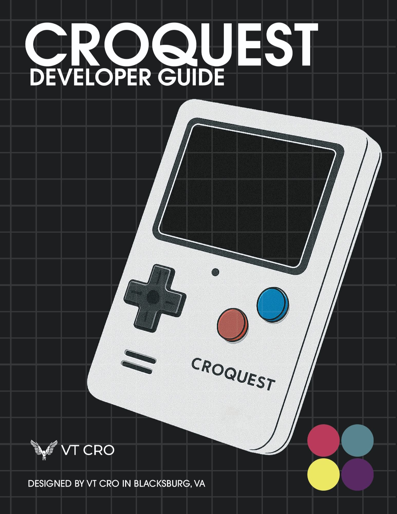

# 🕹️ CroQuest

**CroQuest** is a retro-style handheld game console powered by the ESP32 microcontroller. If features a custom UI, SD-card-loaded assets, Bluetooth multiplayer, and a variety of original games - all packed into a portable device.

---

## 📸 Preview



---

- 🎮 8+ preloaded games: Pong, Snake, Chess, Tic Tac Toe, Simon, Connect 4, Memory, Tetris, Breakout
- 🧠 Single & multiplayer modes via BLE
- 🔊 Audio control and custom sound effects
- 🏆 Unlockable badges and achievements
- 💾 SD card support for game assets and save data
- 📟 Animated menus, numeric input, and game state sync
- 🎨 Fully customizable user name, screen brightness, and profile badges

---

## 📁 Repository Structure

```bash
CroQuest
├── ESP32/                 # Main firmware and source code
│   ├── src/              # All game and system modules
│   ├── include/          # Header files
│   ├── lib/              # External libraries
│   └── Files/            # PCB designs, diagrams, scripts
└── SD/                   # SD card content
    ├── assets/           # JPEG assets for games and UI
    └── saves/            # Saved data (e.g., badges, settings)
```
